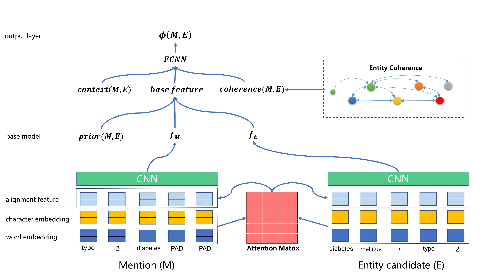
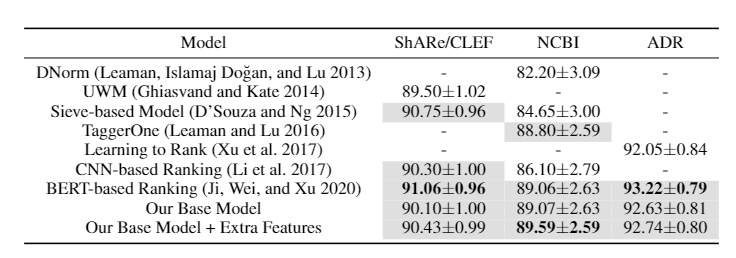

# Biomedical-Entity-Linking
This is a Keras implementation of the paper [A Lightweight Neural Model for Biomedical Entity Linking](https://arxiv.org/abs/2012.08844).


## Environment setup
Clone the repository and set up the environment via "requirements.txt". Here we use python3.6. 
```
pip install -r requirements.txt
```
## Data preparation
**Dataset.** 
It is not easy to collect all related data quickly. For your convenience, we provide all preprocessed datasets so that you could run our model straight. 
But there is a data license of the ShARe/CLEF dataset, we suggest you to obtain it according to an official guideline.
We valid our model on three datasets, ShARe/CLEF, NCBI and ADR. Download these dataset and their corresponding knowledge bases following the urls below.
| Dataset | Reference KB  |
|------|------|
| [NCBI disease](https://www.ncbi.nlm.nih.gov/CBBresearch/Dogan/DISEASE/) | [MEDIC (July 6, 2012)](http://ctdbase.org/downloads/#alldiseases) |
| [ShARe/CLEF eHealth 2013 Challenge](https://physionet.org/content/shareclefehealth2013/1.0/) | [SNOMED-CT (UMLS 2012AA)](https://www.nlm.nih.gov/pubs/techbull/mj12/mj12_umls_2012aa_release.html)|
| [TAC 2017 ADR](https://bionlp.nlm.nih.gov/tac2017adversereactions/) | [MedDRA (18.1)](https://www.meddra.org/) |

**Word Embedding.** 
In our experiments, we represent each word by a 200-dimensional word embedding computed on PubMed and
MIMIC-III corpus, which is proposed in this paper[1]. [Downlaod](https://github.com/ncbi-nlp/BioSentVec).
After downloading, put the embedding file in the path `Biomedical-Entity-Linking/input/` 

**Extra Biomedical documents.**
We provide pre-trained entity embeddings. You can find them in this path `Biomedical-Entity-Linking/output/*dataset name*/embed/entity_emb_50.txt`
Certain entities are more likely to occur together
in the same document than others, and we can leverage
this disposition to help the entity linking. To capture the
co-occurrence of entities, we pre-train entity embeddings in
such a way that entities that often co-occur together have
a similar distributed representation. We train these embeddings
with Word2Vec on a collection
of PubMed abstracts2. Since the entities in this corpus are
not linked to our KB, we consider every occurrence of an
exact entity name as a mention of that entity.
Here, the medical corpus we adopt is a collection of PubMed abstracts
which can be obtained at *ftp://ftp.ncbi.nlm.nih.gov/pubmed/baseline/*

## Evaluation
First you can use `-help` to show the arguments
```
python train.py -help
```
Once completing the data preparation and environment setup, we can evaluate the model via `train.py`.
We have also provided datasets after preprocessing, you can just run the mode without downloading.
```
python3 train.py -dataset ncbi
```

**Using Optimal Parameters**
1. NCBI datast
```
python train.py -dataset ncbi 
```
2. ShARe/CLEF dataset
```
python train.py -dataset clef -hinge 0.30 -alpha 0.6 
```
3. ADR dataset
```
python train.py -dataset adr    
```
**Adding Features**
1. add prior
```
python train.py -dataset ncbi -add_prior True
```
2. add context
```
python train.py -dataset ncbi -add_context True
```
3. add coherence
```
python train.py -dataset ncbi -add_coherence True -voting_k 10
```
```
-voting_k 8 for ncbi
-voting_k 10 for adr
-voting_k 15 for ShARe/CLEF
```
**Result**



## Reference
[1] Zhang Y, Chen Q, Yang Z, Lin H, Lu Z. BioWordVec, improving biomedical word embeddings with subword information and MeSH. Scientific Data. 2019.
